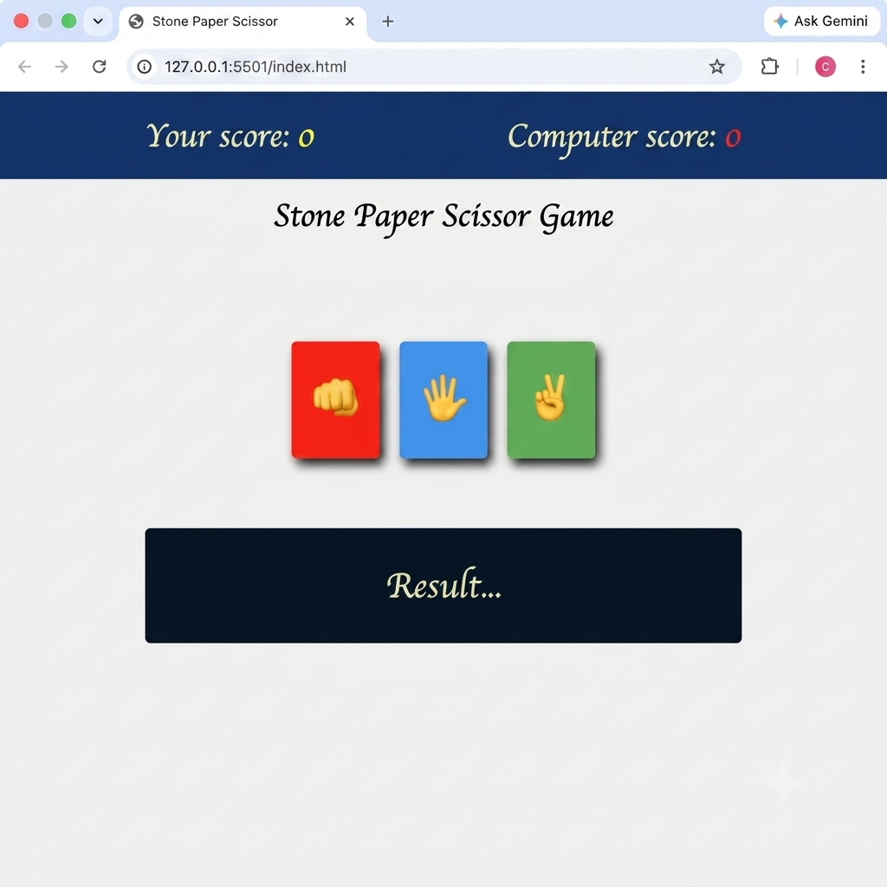

# Stone Paper Scissor Game ✊📄✂️

A simple and interactive **Stone Paper Scissor** game built using **HTML**, **CSS**, and **JavaScript**. The game allows users to compete against the computer with real-time score tracking, random computer moves, and an intuitive user interface.

<a href="https://github.com/chetan202022/Stone-Paper-Scissor-Game" target="_blank">
  
</a>

---

## 📸 Preview

<p align="center">

</p>

---

## 📋 Table of Contents

- [Features](#features)
- [Tech Stack](#tech-stack)
- [Installation](#installation)
- [Usage](#usage)
- [Game Rules](#game-rules)
- [Project Structure](#project-structure)
- [Contributing](#contributing)
- [Author](#author)

---

<h2 id="features">✨ Features</h2>

- Interactive Stone Paper Scissor gameplay
- Random computer move generation
- Live score tracking
- Instant result display
- Responsive and clean user interface
- Smooth hover animations
- Lightweight and fast
- Cross-browser compatible

---

<h2 id="tech-stack">🛠️ Tech Stack</h2>

### Frontend

| Technology | Purpose |
|------------|---------|
| HTML5 | Page Structure |
| CSS3 | Styling & Layout |
| JavaScript (ES6) | Game Logic & DOM Manipulation |

---

<h2 id="installation">⚙️ Installation</h2>

### Prerequisites

- Any modern web browser

### Clone Repository

```bash
git clone https://github.com/chetan202022/Stone-Paper-Scissor.git

cd Stone-Paper-Scissor
```

---

<h2 id="usage">🚀 Usage</h2>

Simply open the project in your preferred browser.

If using VS Code, install the **Live Server** extension and launch the project.

Or open:

```text
index.html
```

### How to Play

1. Choose **Rock**, **Paper**, or **Scissor**.
2. The computer randomly selects its move.
3. The winner is determined based on the game rules.
4. Scores are automatically updated.
5. Continue playing as many rounds as you like.

---

<h2 id="game-rules">🎯 Game Rules</h2>

| Choice | Beats |
|--------|-------|
| ✊ Rock | ✂️ Scissor |
| 📄 Paper | ✊ Rock |
| ✂️ Scissor | 📄 Paper |

If both players choose the same option, the round ends in a draw.

---

<h2 id="project-structure">📁 Project Structure</h2>

```text
Stone-Paper-Scissor-Game/
│
├── index.html
├── style.css
├── script.js
├── README.md
└── Screenshots/
    └── demo.png
```

---

<h2 id="contributing">🤝 Contributing</h2>

Contributions are welcome!

To contribute:

1. Fork the repository

2. Create a feature branch

```bash
git checkout -b feature/AmazingFeature
```

3. Commit your changes

```bash
git commit -m "Add AmazingFeature"
```

4. Push the branch

```bash
git push origin feature/AmazingFeature
```

5. Open a Pull Request

---

<h2 id="author">👨‍💻 Author</h2>

# Chetan Yadav

<p>

<a href="https://github.com/chetan202022">

</a>

<a href="https://linkedin.com/in/chetan-yadav-a21b0a289">

</a>

<a href="https://leetcode.com/u/Chetan__10/">

</a>

</p>

---

## ⭐ Support

If you found this project helpful, please consider:

- Giving it a ⭐ on GitHub
- Sharing it with others
- Providing feedback or suggestions

---